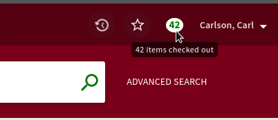
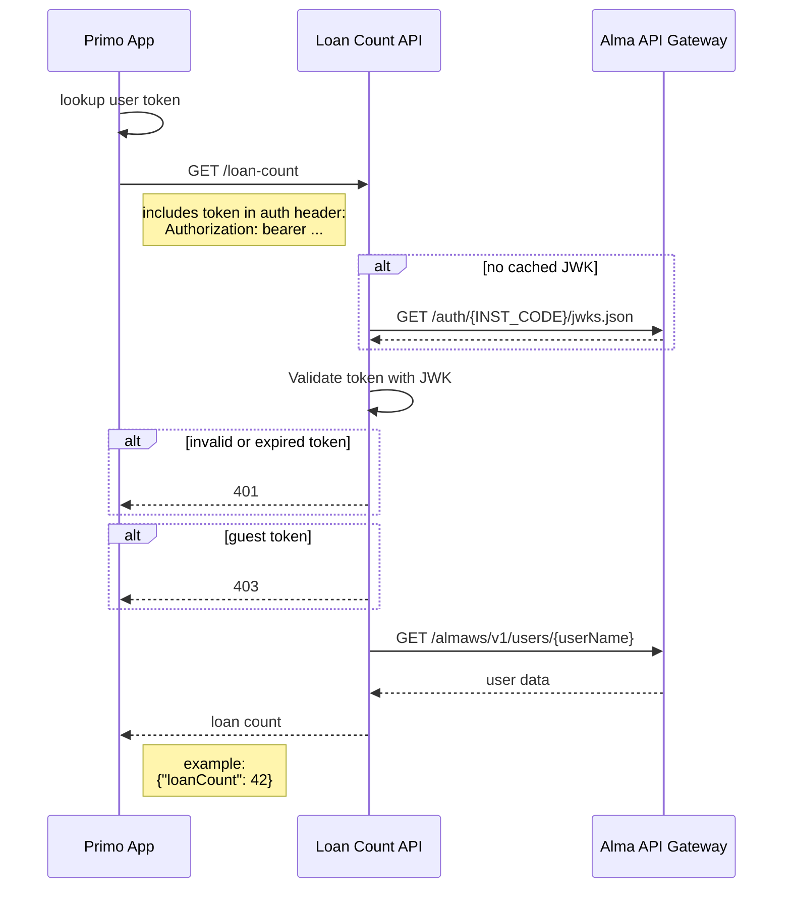

# Primo JWK Auth Example

This is a supplement to an ELUNA 2024 Developers Day [presentation](slides.pdf). It's a somewhat pointless, but hopefully instructive, example of using a Primo institution's [JWKS](https://datatracker.ietf.org/doc/html/rfc7517) to validate tokens for external integrations. 

*Note: This project is intended to serve as a didactic demonstration. If you really wanted to implement this feature, it'd be easier (and more sensible) to just use Primo's built-in `LoanService`.*


## Overview

When a users sign in, a count of their checked-out items will appear in the top bar:



I have no idea why anyone actually would want this, but the utility of the feature isn't the point. It's just a way to show how Primo tokens can be used to verify an identity claim for just about any third-party integration. 

### Loan Count API

Express.js application that handles Primo token validation and Alma API communication ([api/server.js](api/server.js))

### Primo Custom JavaScript

Primo AngularJS module that sends the token to the loan count endpoint and displays the results application's top bar ([primo/custom.js](primo/custom.js)) 

## Sequence Diagram



## Setup

**Only works with Primo VE**

If you want to try running this yourself: 

1. Make sure Node.js version 18+ is installed.
2. Clone this repository.
3. From the project's root directory, run `npm install`.
4. Create a file named `.env` in the project's root directory.
5. Edit the `.env` file to look something like this (values will vary depending on your environment): 

    ```sh
    INST_CODE="..." # your Alma institution code
    ALMA_API_KEY="..." # key should have read-only user permissions
    PROXY_TARGET="..." # Primo base URL (e.g. https://foo.primo.exlibrisgroup.com)
    REGION="na" # change this if you're not in North America
    ALMA_API_BASE_URL="https://api-${REGION}.hosted.exlibrisgroup.com/almaws/v1"
    JWKS_URI="https://api-${REGION}.hosted.exlibrisgroup.com/auth/${INST_CODE}/jwks.json"
    ```

6. Now run `npm start`. This will launch the Loan Count server and a very dumb proxy that enables you to preview the local `primo/custom.js` in your Primo site (in any view).
7. You should now be able to visit `http://localhost:3000/discovery/search?vid={YOUR_VIEW_ID}`, and the loan count badge should appear when you sign in.
